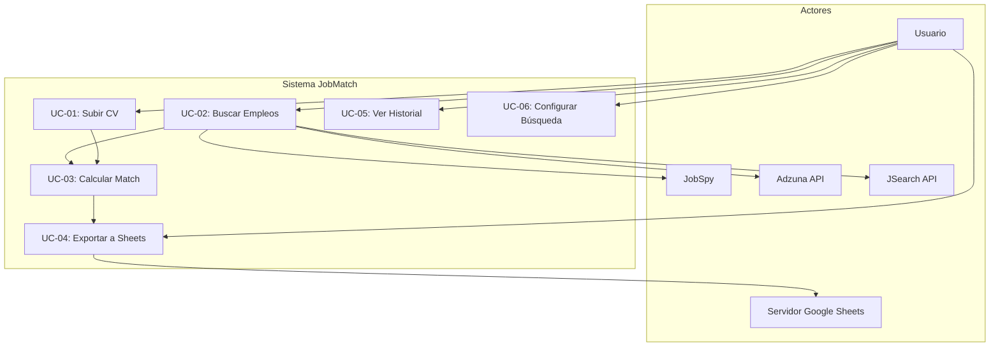
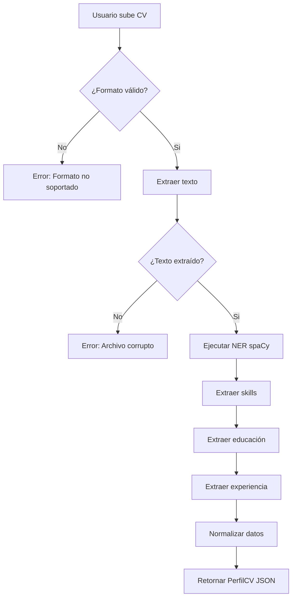
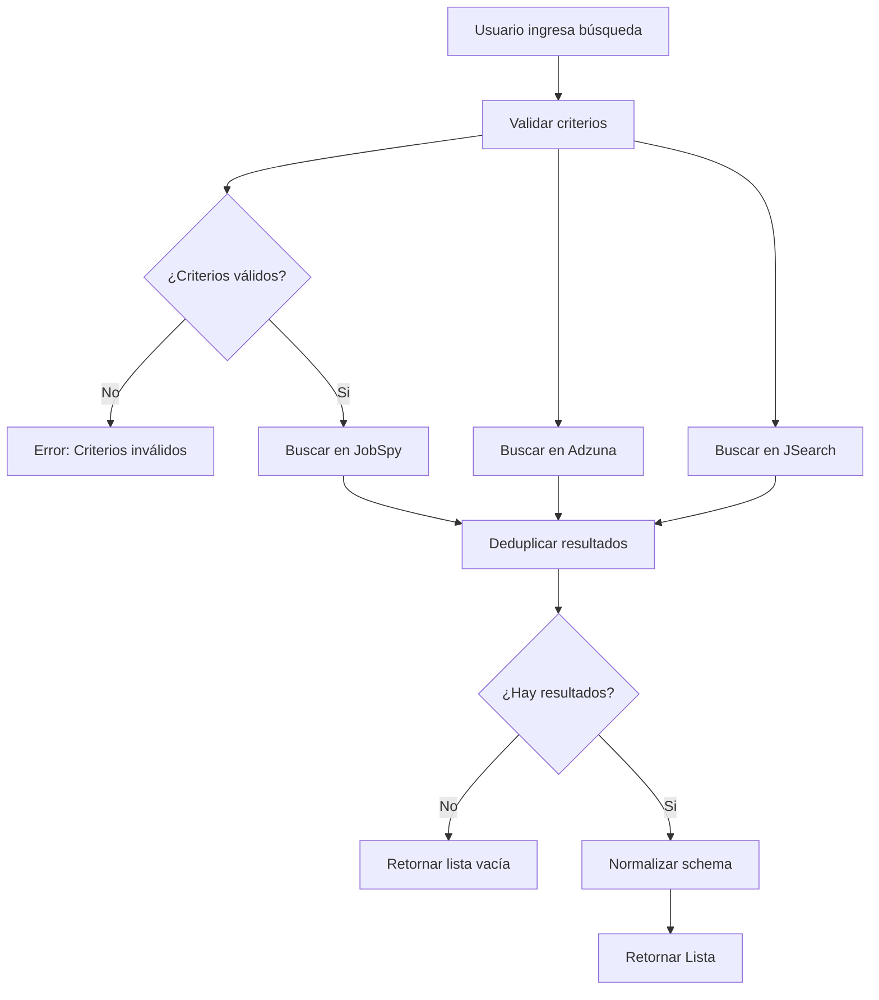
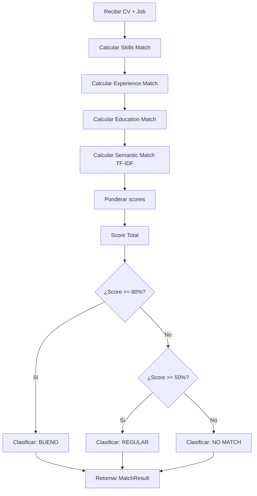
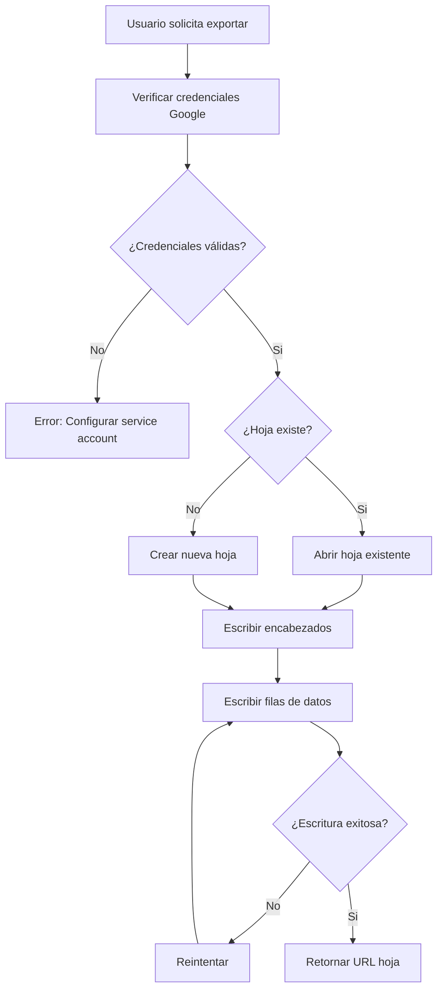
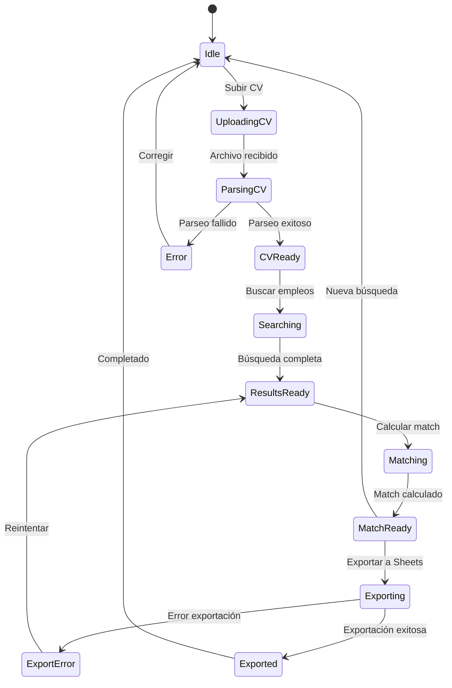
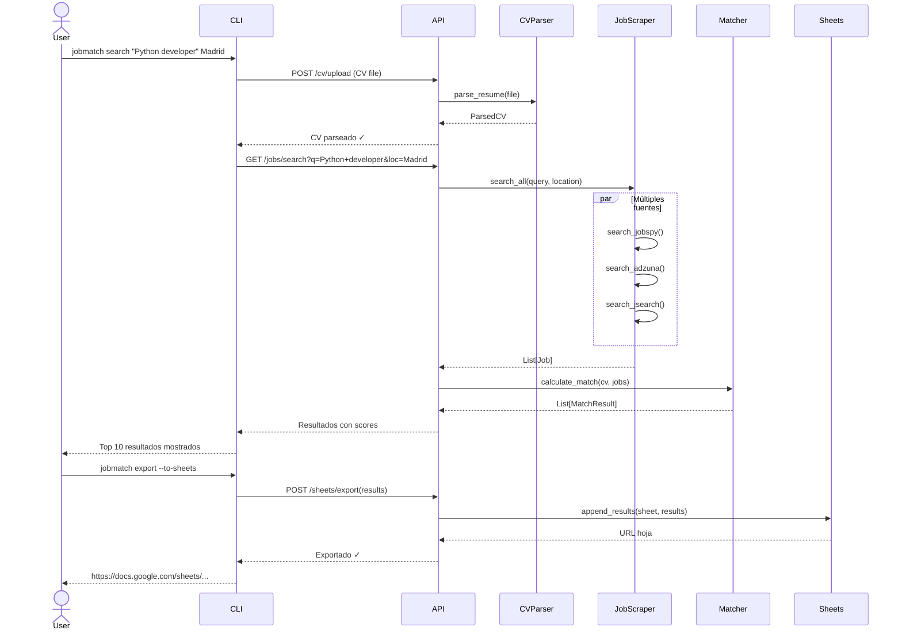

# Casos de Uso - JobMatch

## 1. Diagrama de Casos de Uso General

---

## 2. Casos de Uso Detallados

### UC-01: Subir CV

| Campo | Descripción |
|-------|-------------|
| **Nombre** | Subir y parsear CV |
| **Actor principal** | Usuario |
| **Precondiciones** | Archivo CV disponible (PDF o DOCX) |
| **Postcondiciones** | Perfil parseado almacenado en memoria |

**Flujo Principal:**
1. Usuario selecciona archivo CV (PDF/DOCX)
2. Sistema valida formato
3. Sistema extrae texto del archivo
4. Sistema ejecuta NER (Named Entity Recognition)
5. Sistema extrae: nombre, email, teléfono, skills, educación, experiencia
6. Sistema normaliza skills a taxonomy estándar
7. Sistema retorna perfil parseado en JSON

**Flujos Alternativos:**
- 2a. Formato no válido → Error: "Formato no soportado"
- 3a. No se extrae texto → Error: "Archivo corrupto o imagen"
- 4a. NER falla parcialmente → Retorna campos disponibles + warning

**Diagrama de Flujo:**

---

### UC-02: Buscar Empleos

| Campo | Descripción |
|-------|-------------|
| **Nombre** | Buscar ofertas de empleo |
| **Actor principal** | Usuario |
| **Precondiciones** | Perfil CV parseado (opcional para búsqueda sin match) |
| **Postcondiciones** | Lista de ofertas obtenida |

**Flujo Principal:**
1. Usuario ingresa criterios de búsqueda:
   - Palabra clave (ej: "Python developer")
   - Ubicación (ej: "Madrid" o "Remoto")
   - Tipo de empleo (opcional)
2. Sistema valida criterios
3. Sistema ejecuta búsqueda en paralelo:
   - JobSpy (Indeed, LinkedIn, Glassdoor)
   - Adzuna API
   - JSearch API
4. Sistema deduplica resultados
5. Sistema retorna lista normalizada de ofertas

**Flujos Alternativos:**
- 3a. Una fuente falla → Continúa con otras fuentes
- 3a.1. Todas fallan → Error: "No se pudieron obtener resultados"
- 4a. Sin resultados → Retornar lista vacía

**Diagrama de Flujo:**

---

### UC-03: Calcular Match

| Campo | Descripción |
|-------|-------------|
| **Nombre** | Calcular porcentaje de compatibilidad |
| **Actor principal** | Sistema (automático) |
| **Precondiciones** | Perfil CV + Lista de ofertas |
| **Postcondiciones** | Ofertas con score de match |

**Flujo Principal:**
1. Para cada oferta en la lista:
   a. Calcular match de skills (40%)
   b. Calcular match de experiencia (25%)
   c. Calcular match de educación (15%)
   d. Calcular similaridad semántica TF-IDF (20%)
   e. Calcular score total ponderado
   f. Clasificar: Bueno/Regular/No match
   g. Identificar skills faltantes
2. Ordenar resultados por score descendente
3. Retornar resultados enriquecidos

**Clasificación:**
- **Bueno**: 80-100% → Altamente compatible
- **Regular**: 50-79% → Parcialmente compatible
- **No match**: <50% → Baja compatibilidad

**Diagrama de Flujo:**

---

### UC-04: Exportar a Google Sheets

| Campo | Descripción |
|-------|-------------|
| **Nombre** | Exportar resultados a hoja de cálculo |
| **Actor principal** | Usuario |
| **Precondiciones** | Resultados de búsqueda disponibles + Credenciales Google |
| **Postcondiciones** | Datos escritos en Google Sheets |

**Flujo Principal:**
1. Usuario solicita exportar resultados
2. Sistema verifica credenciales Google
3. Sistema crea/abre hoja de cálculo
4. Sistema escribe encabezados
5. Sistema escribe filas con datos:
   - Fecha
   - Empresa
   - Puesto
   - Match %
   - Skills faltantes
   - URL oferta
   - Fuente
   - Estado (Pendiente)
6. Sistema retorna URL de la hoja

**Flujos Alternativos:**
- 2a. Sin credenciales → Error: "Configurar service account"
- 4a. Hoja existe → Append a hoja existente
- 5a. Error de escritura → Reintentar 3 veces

**Diagrama de Flujo:**

---

### UC-05: Ver Historial de Búsquedas

| Campo | Descripción |
|-------|-------------|
| **Nombre** | Consultar búsquedas anteriores |
| **Actor principal** | Usuario |
| **Precondiciones** | Búsquedas previas guardadas |
| **Postcondiciones** | Historial mostrado |

**Flujo Principal:**
1. Usuario solicita ver historial
2. Sistema lee caché de búsquedas
3. Sistema retorna lista de búsquedas con:
   - Fecha
   - Criterios
   - Cantidad de resultados
   - Mejor match score

---

### UC-06: Configurar Búsqueda

| Campo | Descripción |
|-------|-------------|
| **Nombre** | Guardar configuración de búsqueda |
| **Actor principal** | Usuario |
| **Precondiciones** | Ninguna |
| **Postcondiciones** | Configuración guardada |

**Flujo Principal:**
1. Usuario define configuración:
   - Fuentes a usar
   - Filtros por defecto
   - Ubicación por defecto
2. Sistema guarda en .env o config.json
3. Sistema confirma guardado

---

## 3. Diagrama de Estados

---

## 4. Matriz de Requerimientos vs Casos de Uso

| Requerimiento | UC-01 | UC-02 | UC-03 | UC-04 | UC-05 | UC-06 |
|---------------|-------|-------|-------|-------|-------|-------|
| CV-01: Subir PDF | X | | | | | |
| CV-02: Subir DOCX | X | | | | | |
| CV-03: Extraer texto | X | | | | | |
| CV-04: Detectar datos | X | | | | | |
| CV-05: Detectar skills | X | | X | | | |
| JOB-01: Buscar keyword | | X | | | | |
| JOB-02: Buscar ubicación | | X | | | | |
| JOB-06: Multi-fuente | | X | | | | |
| MATCH-01: Skills match | | | X | | | |
| MATCH-05: Clasificar | | | X | | | |
| EXP-01: Google Sheets | | | | X | | |
| EXP-05: Append | | | | X | | |

---

## 5. Diagrama de Secuencia - Flujo Completo

---

*Documento generado: Septiembre 2026*
